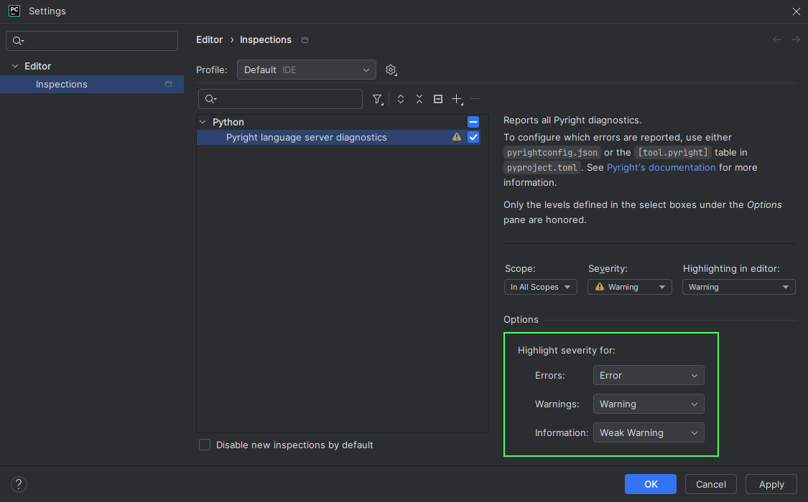

## Executable

For the plugin to work, at least one executable file needs to be defined
using either the <b>Global</b> or <b>Project</b> panel.

!!! question "[How do I install the executables?][1]"

Such a file is typically named
`pyright-langserver`/`pyright-python-langserver`
and can likely be found in:

!!! note

    The locations mentioned here are for Pip and NPM-like managers.
    For other tools (e.g. Homebrew), see their documentation
    to know where they store their executable files.

| Manager | Type   | OS      | Directory                                          |
|:--------|:-------|:--------|:---------------------------------------------------|
| NPM     | Global | Windows | `%APPDATA%\npm`                                    |
| NPM     | Global | Linux   | `/usr/local/bin`                                   |
| Pip     | Global | Windows | `%LOCALAPPDATA%\Programs\Python\<version>\Scripts` |
| Pip     | Global | Linux   | `~/.local/bin`                                     |
| NPM     | Local  | Windows | `.\node_modules\.bin`                              |
| NPM     | Local  | Linux   | `./node_modules/.bin`                              |
| Pip     | Local  | Windows | `.\<your-venv>\Scripts`                            |
| Pip     | Local  | Linux   | `./<your-venv>/bin`                                |

??? question "What's the difference between these files?"

    [TLDR][2]: Some may output "unexpected" things.

!!! note

    For this plugin to work with a WSL project,
    its interpreter and the executable must be
    located within the same distribution.

If the executables can't be found in the aforementioned locations,
see the following pages for more information:

* <i>[Where does npm install packages?][3]</i> - <i>Stack Overflow</i>
* <i>[Where does pip install its packages?][4]</i> - <i>Stack Overflow</i>
* <i>[folders][5]</i> - <i>npm Docs</i>

You can also use a relative path.
It would be interpreted as relative to the project directory.

The executable is used as-is with no additional checks,
so the plugin will still work even if, for example,
it's a wrapper script that outputs diagnostics in the expected format.

!!! tip

    For the best experience, always use or maintain compatibility
    with the latest version of Pyright.

### UI hints

As a path field is edited, the small hint under the field
will show whether the path is valid or invalid.

This is only used to give a general hint;
a path can still be saved even if it is marked as invalid.

### Always use global

Check this option to always use the global executable,
even when the project also has an executable specified.

Default: `false`

### Auto-suggest executable

Check this option to automatically find and
suggest an executable for the current project on open.
See [the corresponding feature][6] for more information.

Default: `true`

## Inspection entry

This plugin can be disabled by disabling the inspection
<i>Pyright language server diagnostics</i>,
which can be found under <b>Editor</b> | <b>Inspections</b>.
However, this is not recommended for other purposes than debugging.

Doing so would cause existing sessions to stop
when [the restart button][7] is clicked,
and new sessions would not be started.

### Highlight severity levels

Pyright diagnostics have [three possible levels][8]:
Error, warning, and information.
These can be mapped to different highlight severity levels in the IDE.

!!! note

    The language server may also output "hint" diagnostics
    that report code as ["unnecessary" or "deprecated"][9].
    These can be [disabled][10] from the global configuration panel.

The target levels can be configured via
the inspection's corresponding settings pane.

!!! note ""

    Only the levels defined in the dropdowns
    under the <i>Options</i> pane are honored.

For each diagnostic level, there are four highlight levels to choose from:

| Level        | Default effects       |
|--------------|-----------------------|
| Error        | Red squiggles         |
| Warning      | Yellow squiggles      |
| Weak warning | Dark yellow squiggles |
| Information  | No visible effects    |

!!! info ""

    These levels are semantical, not visual.

The <i>Information</i> level is the only one not considered
"problematic" by the IDE. Annotations of this kind
will not be reported as "problems" during batch inspections
(<i>File</i>, <i>Project Errors</i> and similar tabs in
the <i>Problems</i> tool window).

!!! note

    Despite having no visible effects,
    <i>Information</i> annotations are still shown on hover.

    === "Information"

        

    === "Weak warning"

        

#### Recommended levels

| Diagnostic  | For most users (default) | For lax users |
|-------------|--------------------------|---------------|
| Error       | Error                    | Warning       |
| Warning     | Warning                  | Weak warning  |
| Information | Weak warning             | Weak warning  |

## Tooltips

These options are not applied retroactively;
you need to make an edit to see the effect.

### Use editor font

Check this option to display tooltips in the editor font.

Default: `false`

=== "Enabled"

    

=== "Disabled"

    

### Add prefix

Check this option to prefix tooltips with "Pyright:".

Default: `false`

=== "Enabled"

    

=== "Disabled"

    

### Link error codes

Enable this option to display error codes as links.

Default: `false`

=== "Enabled"

    

=== "Disabled"

    

## Language server settings

These settings are not applied retroactively;
the server needs to be [restarted][7] for them to have effects.

### Auto-restart server

Check this option to automatically restart
the language server on configuration change.

[Highlight severity level settings][11]
will not trigger this behaviour.

Default: `false`

!!! note

    The server might be restarted more than once if
    both configuration panels are modified.

### Completion support

Check this option to enable completion support.

Default: `false`

=== "Enabled"

    

=== "Disabled"

    

!!! note

    The autocompletion result might be modified by the plugin
    depending on other configurations listed below.

### Auto-import completions

Uncheck this option to prevent the language server from offering
completions which, if accepted, will also add a `import` statement
for that newly introduced symbol.

This corresponds to the `python.analysis.autoImportCompletions` setting.

Default: `true`

=== "Auto-import completions enabled"

    

=== "Auto-import completions disabled"

    

=== "Completion support disabled"

    

### Monkeypatch auto-import details

Uncheck this option to prevent the original completion item detail
("<i>Auto-import</i>" or a similar localized message)
from being overridden by its import source.

Default: `true`

=== "Enabled"

    

=== "Disabled"

    

### Autocomplete parentheses

Check this option to also automatically insert parentheses
for function, method and constructor completions.

Default: `false`

=== "Before"

    

=== "Disabled"

    

=== "Enabled"

    

### Monkeypatch trailing quote bug

Uncheck this option to use the IDE's native implementation
when applying quoted completions,
which may insert extraneous trailing quotes.

Upstream issue: [IJPL-155741][12].

Default: `true`

=== "Before"

    

=== "Enabled"

    

=== "Disabled"

    

### Diagnostics support

Uncheck this option to disable diagnostics support.

Default: `true`

=== "Enabled"

    

=== "Disabled"

    

### Tagged hints

Uncheck this option to prevent the language server from emitting
"Unnecessary" and "Deprecated" hints, which are visualized in the IDE
as faded-out and strikethrough text, correspondingly.

This corresponds to the `pyright.disableTaggedHints` setting.

Default: `true`

=== "Enabled"

    

=== "Disabled"

    

### Hover support

Uncheck this option to disable hover support.

Default: `true`

=== "Enabled"

    

=== "Disabled"

    

### Go-to-definition support

Check this option to enable go-to-definition support.

Default: `false`

!!! note

    As of yet, PyCharm's native support is
    prioritized over the language server's.

    This means <kbd>Ctrl</kbd> <kbd>B</kbd> (or similar shortcuts)
    will only trigger PyCharm's support on tokens it can handle
    (that is, most of them).

    The difference between the set of all tokens which Pyright support
    and that of PyCharm is currently unknown.

    See [this issue][13] for more information.

### Log level

!!! note

    Language server logs are not recorded in `idea.log` by default.
    You need to manually [enable it][14].

Modify this option to make the language server
emit more or less [log messages][15].

This corresponds to the `python.analysis.logLevel` setting.

Default: <i>Information</i>

### Locale

Modify this option to make the language server
emit messages in different languages.

This corresponds to the `LC_ALL` environment variable.

Default: <i>Default</i> (no value set)

### Add common search paths

Uncheck this option to tell the language server not to add
common search paths like `src` when there are
no execution environments defined in the configuration file.

This corresponds to the `python.analysis.autoSearchPaths` setting.

Default: `true`

### Targeted file extensions

A file whose extension is included in this list will be recognized
as suitable for the language server to run on.
This is useful if you use a server
whose support range is wider than that of Pyright.

Each extension should be written on one line when the editor is expanded.
Otherwise, use the pipe character (`|`) to separate them.

Leading and trailing whitespace are stripped away.
Blank extensions are thus considered invalid.

Default: `py`, `pyi`

!!! note

    Presumably, due to a limitation/bug of IntelliJ,
    characters like "🔥" (U+1F525 Fire, the extension for [Mojo][16])
    cannot be serialized correctly into setting files
    and therefore will not persist between IDE sessions.

    Testing shows that this affects characters
    whose codepoints are greater than U+FFFD.

### Diagnostic mode

!!! note

    This option's usefulness is as of yet unknown.

Modify this option to control the number of files
for which the language server will analyze and report diagnostics.

This corresponds to the `python.analysis.diagnosticMode` setting.

Default: *Open files only*

### Workspace folders

The folders defined by this option will be passed
to the language server as "[workspace folders][17]".
Pyright will only recognize `pyproject.toml`/`pyrightconfig.json` files
which are direct children of these folders.

Possible choices:

* <i>Project base directories</i>:
  Top-level directories which contain files related to the project,
  often only one (project root).
* <i>Source roots</i>:
  Directories marked as "[source roots][18]".

Default: <i>Project base directories</i>

  [1]: how-to.md#how-to-install-the-pyright-executables
  [2]: https://insyncwithfoo.github.io/pyright-for-pycharm/faq/#whats-the-difference-between-the-pyright-and-pyright-python-files
  [3]: https://stackoverflow.com/q/5926672
  [4]: https://stackoverflow.com/q/29980798
  [5]: https://docs.npmjs.com/cli/v10/configuring-npm/folders#executables
  [6]: features.md#executable-suggestion
  [7]: how-to.md#how-to-restart-the-language-server
  [8]: https://microsoft.github.io/pyright/#/configuration?id=type-check-diagnostics-settings
  [9]: https://microsoft.github.io/language-server-protocol/specifications/lsp/3.17/specification/#diagnosticTag
  [10]: #tagged-hints
  [11]: #highlight-severity-levels
  [12]: https://youtrack.jetbrains.com/issue/IJPL-155741
  [13]: https://github.com/InSyncWithFoo/pyright-langserver-for-pycharm/issues/29
  [14]: how-to.md#how-to-enable-language-server-logging
  [15]: logging.md
  [16]: https://en.wikipedia.org/wiki/Mojo_(programming_language)
  [17]: https://microsoft.github.io/language-server-protocol/specifications/lsp/3.17/specification/#workspace_workspaceFolders
  [18]: https://www.jetbrains.com/help/pycharm/content-root.html
