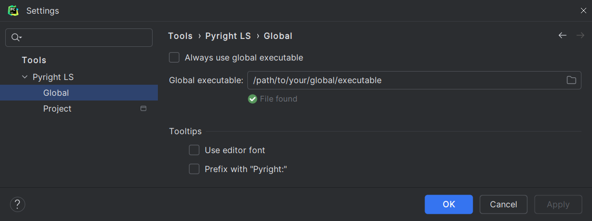
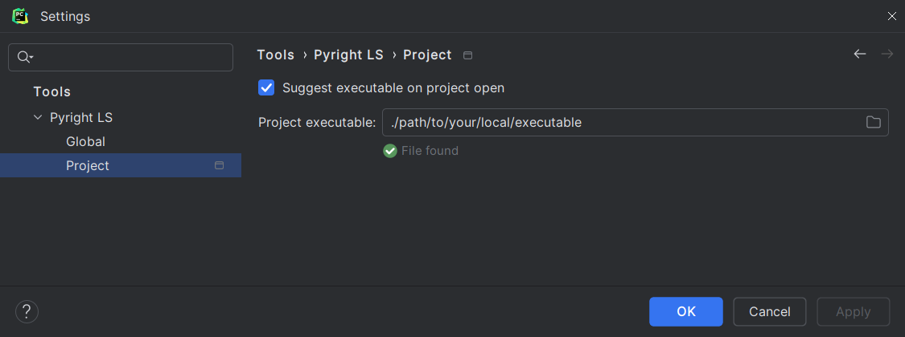

# Pyright&nbsp;Language&nbsp;Server&nbsp;for&nbsp;PyCharm user&nbsp;documentation

This site serves as the user documentation for
[the <i>Pyright Language Server</i> PyCharm plugin][1].

The plugin is dependent on [the experimental language server protocol APIs][2]
which are only available for PyCharm Professional and other paid IDEs
since 2023.2. This means that PyCharm Community users cannot use it.

!!! warning

    This plugin will be deprecated and merged into
    [its sister][3] in the near future.

## Usage

Go to <b>Settings</b> | <b>Tools</b> |
<b>Pyright LS (Global)</b> / <b>Pyright LS (Project)</b>
and set the path to [your Pyright language server executable][4].

=== "Global"

    

=== "Project"

    

You might need to reopen your files or restart the IDE
for the files to be recognized by the language server.
If that doesn't work, refer to <i>[Problems and solutions][5]</i>.

## Enable logging

You are strongly encouraged to [enable logging][6].
This way, all requests and responses will be recorded in `idea.log`
for further analysis should a problem arises.

  [1]: https://plugins.jetbrains.com/plugin/24146
  [2]: https://plugins.jetbrains.com/docs/intellij/language-server-protocol.html
  [3]: https://github.com/InSyncWithFoo/pyright-for-pycharm
  [4]: configurations.md#executable
  [5]: problems.md
  [6]: how-to.md#how-to-enable-language-server-logging
